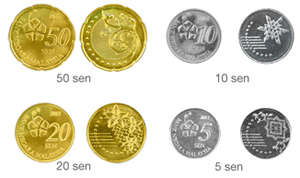

# Custom Training with TensorFlow Object Detection (TFOD) API

## Summary
A project to train an object detection model to detect Malaysia coins and the value of the coins.

The Malaysia coins that can be detected are only from the three images below. This is based on the Malaysia's standard according to the government Website for [First Series](https://www.bnm.gov.my/-/the-first-series-past-coin) and [Second Series](https://www.bnm.gov.my/-/the-second-series-past-coin) and [Third Series](https://www.bnm.gov.my/-/third-series-of-malaysian-coins).

NOTE: In the Jupyter notebook, only the `50`, `20`, `10`, and `5 cents` classes will be used because both `1 cent` and `1 ringgit` coins are not usable in Malaysia anymore.

**First Series** <br>
[](https://www.bnm.gov.my/-/the-first-series-past-coin)

**Second Series** <br>
[](https://www.bnm.gov.my/-/the-second-series-past-coin)

**Third Series** <br>
[](https://www.bnm.gov.my/-/third-series-of-malaysian-coins)

## Details of steps
Refer to the `1. Image Collection.ipynb` [notebook](https://github.com/ansonnn07/coin-detection/blob/main/1.%20Image%20Collection.ipynb) for the steps for collecting and labeling the images.

For training, you may open the `2. Training and Detection.ipynb` [notebook](https://github.com/ansonnn07/coin-detection/blob/main/2.%20Training%20and%20Detection.ipynb) directly in [Google Colab](https://colab.research.google.com/github/ansonnn07/coin-detection/blob/main/2.%20Training%20and%20Detection.ipynb) to train there. Or download the notebook to train locally.

You may also refer to the following Colab notebooks to examine the trained version for each of the 3 datasets used in this repo. But the procedure is exactly the same, with only a few modifications to accomodate the download the dataset, and also to modify the class labels for different datasets.
1. Coin detection dataset (small, 29 images, captured with iPhone, trained with SSD model): [link](https://colab.research.google.com/drive/1M0IN3Ya3jT_7UOJ5N2wLepk2ypR78KFB?usp=sharing)
2. Coin detection dataset (large, 277 images, from Google Search, trained with SSD model): [link](https://colab.research.google.com/drive/1aTliHKpwqxZaokf2YTmg0vwmRPUJnpzY?usp=sharing)
3. Face Mask Detection dataset (853 images, trained with CenterNet model): [link](https://colab.research.google.com/drive/11ciR0XNAvICh5teg0AaFsK7sK8iSzVoh?usp=sharing)

## Package Installation for Local Machine
NOTE: If you are on Google Colab, you only need to run some of the cells in the `2. Training and Detection.ipynb` [notebook](https://github.com/ansonnn07/coin-detection/blob/main/2.%20Training%20and%20Detection.ipynb) to install TFOD API, you **DO NOT** need to run the installation steps here.

For this project, it is assumed that you have already installed Anaconda in your machine. The installation for this TFOD API is based on the [official docs here](https://tensorflow-object-detection-api-tutorial.readthedocs.io/en/latest/install.html). 

Run the following command in your Anaconda prompt (Anaconda's terminal or your terminal of choice) to create a virtual environment named `tfod` with Python version 3.8 installed:
```
conda create --name tfod python=3.8
```
Then remember to activate the environment with the command below every time you open up a new terminal before proceeding.
```
conda activate tfod
```

For the purpose of using TensorFlow with GPU on your local machine, please refer to [this YouTube video](https://youtu.be/hHWkvEcDBO0) for complete instructions on how to install the dependencies (CUDA, cuDNN for TensorFlow GPU support). Beware that this is a very tedious and error-prone process, if there is any error, please don't hesitate to ask for help.

After installing TensorFlow, you may proceed to install the rest of the packages with the command below (assuming that your terminal is already inside this repo's directory):
```
pip install --no-cache-dir -r requirements.txt
```

After installing the packages, create a **Jupyter kernel** to be selected in Jupyter Notebook/Lab with this command:
```
python -m ipykernel install --user --name tfod --display-name "tfod"
```

Also run this to update the `ipykernel` to avoid some errors.
```
conda install ipykernel --update-deps --force-reinstall
```

## COCO API Installation

For Windows:
<details><summary> <b>Expand</b> </summary>

1. Download Visual C++ 2015 Build Tools from this [Microsoft Link](https://go.microsoft.com/fwlink/?LinkId=691126) and install it with default selection
2. Also install the full Visual C++ 2015 Build Tools from [here](https://go.microsoft.com/fwlink/?LinkId=691126) to make sure everything works
3. Go to `C:\Program Files (x86)\Microsoft Visual C++ Build Tools` and run the `vcbuildtools_msbuild.bat` file
4. In Anaconda prompt, run
```
pip install cython
pip install git+https://github.com/philferriere/cocoapi.git#subdirectory=PythonAPI
```
5. Go to `C:\Users\<YOUR USERNAME>\anaconda3\envs\tfod\Lib\site-packages\pycocotools` and open up the `cocoeval.py` with your IDE (e.g. VS Code or PyCharm), change each of the two lines of 507 & 508, and also lines 518 & 519 to these two lines of code below. The only difference should be to add the `int` to the `np.round(...)` terms to avoid errors when running evaluation of our model, this is a very [inconvenient workaround for the issue](https://github.com/google/automl/issues/487) because they have not updated to the latest commit from the official COCOAPI GitHub repo. And also the pain of using Windows to install such dependencies (Linux is always easier). You can omit this if you don't care about evaluating your model.
```
self.iouThrs = np.linspace(.5, 0.95, int(np.round((0.95 - .5) / .05)) + 1, endpoint=True)
self.recThrs = np.linspace(.0, 1.00, int(np.round((1.00 - .0) / .01)) + 1, endpoint=True)
```
</details>

<br>
For Linux:
<details><summary> <b>Expand</b> </summary>

```
git clone https://github.com/cocodataset/cocoapi.git
cd cocoapi/PythonAPI
make
cp -r pycocotools <PATH_TO_TF>/TensorFlow/models/research/
```
</details>

## TensorFlow Object Detection (TFOD) Installation

After installing all the packages above, you may proceed to the `Training and Detection.ipynb` notebook to install the rest of the dependencies such as protobuf and the TFOD package. You will only need to install once and you will not need to install them again in the same virtual environment.

## Running Label Studio

Run the following command in your terminal (an error about JSON Field support might pop up but it does not matter, just enter 'n' without the quotes to open up Label Studio):
```
label-studio
```

Or run using Docker
<details><summary> <b>Expand</b> </summary>

Just run the command below in your terminal, all the data and label history will be stored in the `mydata` folder of the current directory where you run the command, and open the Label Studio app in http://localhost:8080/.
```
docker run --rm -it -p 8080:8080 -v `pwd`/mydata:/label-studio/data heartexlabs/label-studio:latest
```

**NOTE**: If you don't have Docker installed in your machine. Then follow the [instructions here at the docs](https://docs.docker.com/get-docker/) to install first. If you are on Windows, you will need to setup both Windows Subsystem for Linux (WSL) and Docker. Windows will need to use WSL in order for the program to work properly. Follow the [documentation here](https://docs.microsoft.com/en-us/windows/wsl/install-win10) for setting up WSL.
</details>

TODO: 
- Add demo images to the `images` folder !!
- Fix the update config step to change to manually update!
- Make an inference script/notebook to show how to run inference