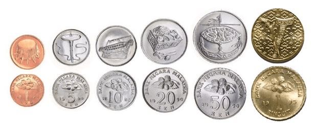

# Coin Detection

## Summary
A project to train an object detection model to detect Malaysia coins and the value of the coins.

The Malaysia coins that can be detected are only from the three images below. This is based on the Malaysia's standard according to the government Website for [First Series](https://www.bnm.gov.my/-/the-first-series-past-coin) and [Second Series](https://www.bnm.gov.my/-/the-second-series-past-coin) and [Third Series](https://www.bnm.gov.my/-/third-series-of-malaysian-coins). But the back of the coins for the **First Series** are too similar, therefore they are excluded from the annotations to avoid erroneous predictions.

**First Series**  

**Second Series**  

**Third Series**  

## Details for the steps
The project starts from downloading images from Google Search using a script prepared based on [PyImageSearch tutorial](https://www.pyimagesearch.com/2017/12/04/how-to-create-a-deep-learning-dataset-using-google-images/). The URLs are scraped using a Javascript script `scrape_image.js` copied from the tutorial. This script will download all the images in the Google image search webpage, therefore, search for the images you want in Google Search, scroll down until the number of images you want (or until the end), then paste all the code here into the Console in your browser (Chrome is recommended). A new file `urls.txt` containing all the image URLs will be downloaded to your computer.

Then, download the images using `download_images.py`. You can choose either to download asynchronously (recommended, much faster) or sequentially. Remember to change the configurations in `config.py` as necessary to make sure the script works as you wanted.

Then, the images will be labelled using [Label Studio](https://labelstud.io/).

The object detection model (YOLOR in this case) is trained and tested in this [Colab Notebook](https://colab.research.google.com/drive/10pKU_u90_jgfDrG3YsMK7h_RbLW6yZ_P).